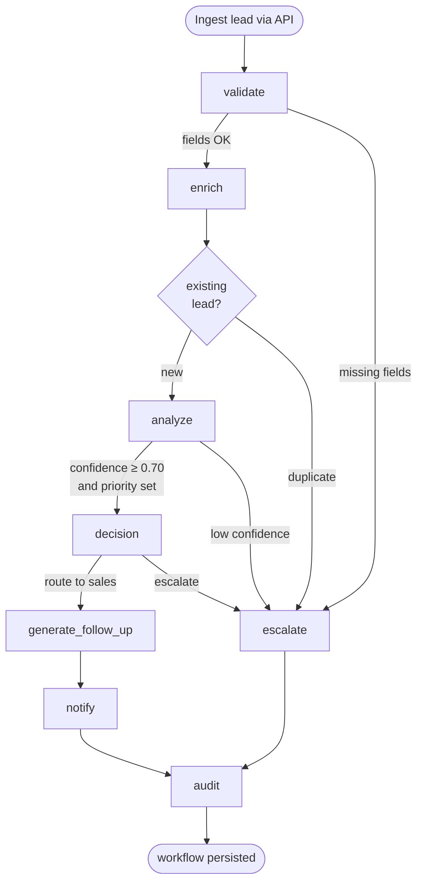
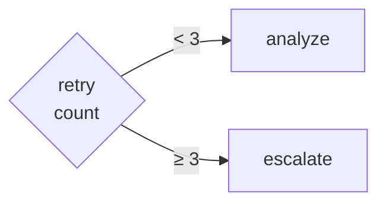
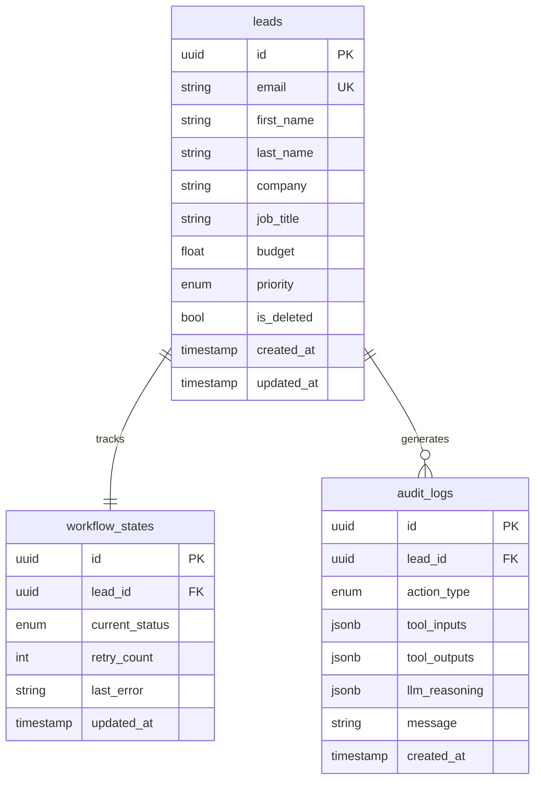

# Architecture — Autonomous Lead Management Worker

## Overview

A FastAPI-served, LangGraph-orchestrated autonomous backend agent that handles the full lifecycle of an inbound sales lead — from ingestion through enrichment, AI scoring, CRM updates, and notification — without human intervention for the common case.

### Tech Stack

| Layer | Technology | Location |
|---|---|---|
| API | FastAPI + Uvicorn/Gunicorn | [`app/main.py`](../app/main.py) |
| Agent Orchestration | LangGraph `StateGraph` | [`app/agents/graph.py`](../app/agents/graph.py) |
| Agent State Schema | Pydantic `BaseModel` | [`app/agents/state.py`](../app/agents/state.py) |
| Decision Engine | Rule-based guardrail layer | [`app/agents/decision_engine.py`](../app/agents/decision_engine.py) |
| LLM Provider | OpenAI GPT-3.5 (configurable) | [`app/core/config.py`](../app/core/config.py) |
| Checkpointing | Redis (`MemorySaver` fallback) | [`app/core/memory.py`](../app/core/memory.py) |
| Primary Storage | SQLAlchemy 2 + PostgreSQL/SQLite | [`app/core/database.py`](../app/core/database.py) |
| Auth | JWT (HS256) + RBAC | [`app/core/security.py`](../app/core/security.py) |
| Logging | Loguru JSON structured | [`app/core/logging_config.py`](../app/core/logging_config.py) |
| Resilience | Tenacity + PyBreaker | [`app/core/resilience.py`](../app/core/resilience.py) |

---

## LangGraph Workflow

### Node Sequence

### Retry Routing

---

## Agent State Model

Defined in [`app/agents/state.py`](../app/agents/state.py) as a Pydantic `BaseModel`. Key fields:

| Field | Type | Purpose |
|---|---|---|
| `lead_id` | `str` | UUID of the `Lead` DB row |
| `workflow_id` | `str` | LangGraph `thread_id` used for Redis checkpointing |
| `status` | `WorkflowStatus` enum | Current pipeline stage |
| `priority` | `LeadPriority` enum | AI-assigned score (HIGH / MEDIUM / LOW / SPAM) |
| `confidence` | `float` | LLM classification confidence [0–1] |
| `retry_count` | `int` | Retries attempted in current node |
| `audit_logs` | `list[dict]` | Per-step action records; flushed to DB in `audit` node |
| `memory` | `dict` | Scratch-pad for tool outputs (enrichment results, CRM status) |

---

## Persistence Layers

### PostgreSQL / SQLite (primary)

Three tables defined in [`app/models/lead.py`](../app/models/lead.py):

All models inherit `BaseModel` ([`app/models/base.py`](../app/models/base.py)) which provides UUID PK, timestamps, and soft-delete (`is_deleted` / `deleted_at`).

### Redis (workflow checkpointing)

`get_checkpointer()` in [`app/core/memory.py`](../app/core/memory.py) returns a `RedisSaver` that snapshots `AgentState` after every node completes, keyed by `workflow_id`. Exact-once semantics: if the server restarts mid-workflow the agent resumes from the last saved checkpoint. Falls back to `MemorySaver` when Redis is unavailable (local dev).

---

## API Surface

Base prefix: `/v1`

| Method | Path | Auth | Role |
|---|---|---|---|
| `POST` | `/auth/login` | None | — |
| `POST` | `/auth/refresh` | None | — |
| `POST` | `/leads/` | Bearer | Any |
| `GET` | `/leads/` | Bearer | Sales, Admin |
| `GET` | `/leads/{id}` | Bearer | Sales, Admin |
| `GET` | `/leads/{id}/status` | Bearer | Sales, Admin |
| `GET` | `/leads/{id}/audit` | Bearer | Sales, Admin |
| `DELETE` | `/leads/{id}` | Bearer | Admin |

Full Swagger docs at `http://localhost:8000/docs` when the server is running.
